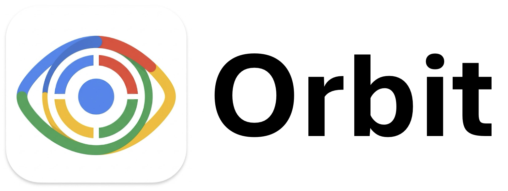

# Head Movement Tracker: Corporate Performance Assessment

> A satirical head-movement game that evaluates your focus — and fires you if you lose it.

<!-- SCREENSHOT: Full welcome/title screen showing the corporate branding and "Begin Assessment" button -->
<!-- Insert screenshot here: assets/screenshots/welcome.png -->

---

## Table of Contents

- [What is this?](#what-is-this)
- [Demo](#demo)
- [Features](#features)
- [Requirements](#requirements)
- [Installation](#installation)
- [Building & Releasing](#building--releasing)
- [License](#license)

---

## What is this?

A real-time gaze-tracking game built with **MediaPipe** and **PyQt5**. Your webcam tracks your head pose and translates it into a gaze position on screen. Your job: keep your eyes on the moving target while a fake corporate OS emails you, asks you to type buzzwords, and ultimately judges your performance.

Three escalating levels. Three increasingly unhinged environments. One HR verdict.

---

## Demo

<!-- SCREENSHOT: All three levels side-by-side or a GIF showing the target moving against the spreadsheet/Gmail/Slides backgrounds -->
<!-- Insert screenshot here — ideally a GIF or a 3-panel image showing Level 1 (Sheets), Level 2 (Gmail), Level 3 (Slides) -->

| Level | Theme | Target Behavior |
|-------|-------|-----------------|
| 1 | Google Sheets | Slow, predictable DVD bounce |
| 2 | Gmail Inbox | Faster bounce + dripping emails |
| 3 | Google Slides | Chaotic stochastic movement |

**Level 1 — Google Sheets**

**Level 2 — Gmail Inbox**

**Level 3 — Google Slides**

<!-- SCREENSHOT: Game Over / "YOU'RE FIRED" screen -->
<!-- Insert screenshot here: assets/screenshots/game_over.png -->

---

## Features

- **Real-time head pose tracking** via MediaPipe FaceMesh (468 3D facial landmarks, no eye hardware needed)
- **Three escalating difficulty levels** with distinct visual environments
- **Danger vignette** — a red edge glow that intensifies the longer you look away
- **Bonus quiz** — pop-up asks you to type corporate buzzwords mid-game for extra points
- **HR verdict** on game over, scaled to your score
- **Calibration** — press `C` to set your current head pose as screen center
- **Original soundtrack** — music, level stingers, and alerts; best experienced with sound on

---

## Requirements

- Python >= 3.9
- A connected webcam
- [`uv`](https://github.com/astral-sh/uv) (fast Python package manager)

Tested on macOS and Windows.

---

## Installation

### Windows

1. Go to the [Releases](https://github.com/OhadGriner/Orbit/releases) page.
2. Download the `.exe` file from the latest release.
3. Run it — no installation required.

### macOS

1. Go to the [Releases](https://github.com/OhadGriner/Orbit/releases) page.
2. Download the `.zip` file from the latest release.
3. Extract the zip to get the `.app` bundle.
4. Move the `.app` to your Applications folder (optional).
5. On first launch, macOS may block it — go to **System Settings → Privacy & Security** and click **Open Anyway**.
---
### How gaze tracking works

1. MediaPipe FaceMesh detects 468 3D facial landmarks each frame.
2. Five key landmarks (nose tip, chin, left/right cheeks, forehead) define a head orientation.
3. Yaw and pitch angles are extracted and smoothed over 16 frames to reduce jitter.
4. Angles are mapped linearly to screen coordinates (±35° yaw / ±18° pitch spans the full display).
5. Press `C` to set the current pose as the "looking straight ahead" reference.

---

## Building & Releasing

Releases are built automatically for both platforms via a GitHub Actions workflow that runs [PyInstaller](https://pyinstaller.org).

To publish a new build:

1. Go to the **Releases** tab on GitHub and create a new release (or push a new tag).
2. GitHub Actions picks it up and runs PyInstaller on both a Windows and a macOS runner.
3. The resulting `.exe` (Windows) and `.app` bundle inside a `.zip` (macOS) are automatically attached to the release as downloadable assets.

No manual build steps required - tagging a release is all it takes.

---

## License

MIT
